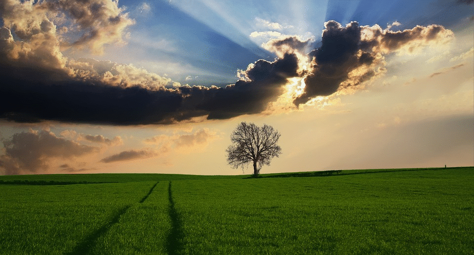

# Segmentize picture

This repository contain a Python script to be use directly in GRASS GIS. It allow for automatic segmentation of an input image, rendering it more abstracted/fuzzy. 

However, according to the resolution and spectral variance of the input image, some parameters should be ajusted manually (threshold\_start, threshold\_stop, threshold\_step, minsizes), otherwise nearly no changes in the resulting image would be visible.

Here are two examples: 

---
